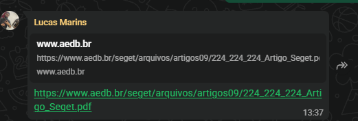
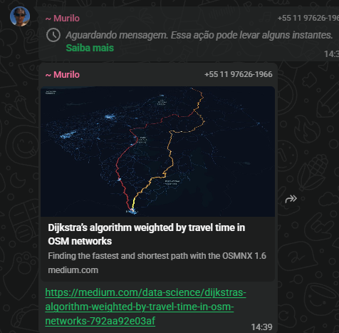

# Etapa (a) — Escolha do Tema

> **Como preencher:** este documento deve ser preenchido **em conjunto pelo grupo**, mas com registro individualizado da contribuição de cada integrante. Substitua os campos entre `[ ]` pelas informações do seu grupo. Não apague as instruções em itálico — elas ajudam na avaliação do orientador.

---

## 1. Identificação do Grupo

| Campo | Informação |
|---|---|
| Curso / Disciplina | Ciência da Computação / Teoria dos Grafos |
| Projeto de Pesquisa / IC | Atlas Global — Sistema Inteligente de Rotas com Teoria dos Grafos |
| Orientador(a) | Profa. Dra. Andréa Ono Sakai |
| Data de entrega desta etapa | `[18/08/2026]` |
| Integrantes do grupo | Vinicius da Silva; Gabriel Nascimento de Souza; Lucas Marins de Souza Oliveira; Murilo Santiago; Guilherme Da Macena` |

---

## 2. Tema Escolhido

### 2.1 Área geral de interesse
*Qual grande área do conhecimento/disciplina motivou a escolha (ex.: complexidade dos algoritmos, classes de problemas P, NP, Algoritmos Gulosos, Programação Dinâmica, Divisão e conquista)?*

Teoria dos Grafos, com foco em algoritmos clássicos de caminho mínimo e exploração de conectividade — especificamente o algoritmo de Dijkstra (busca de caminho de menor custo em grafos ponderados) e a Busca em Largura/BFS (exploração de conexões e verificação de acessibilidade).

### 2.2 Tema delimitado (versão final)
*Escreva o tema já delimitado, de forma específica — não o tema amplo. Lembre-se: o tema deve ser enunciado em 1 a 2 frases, como um assunto (ainda não é uma pergunta de pesquisa, isso vem na etapa "c").*

> **Tema:** Modelagem de um sistema inteligente de rotas baseado em teoria dos grafos, utilizando os algoritmos de Dijkstra e Busca em Largura (BFS) para calcular caminhos mínimos e apoiar operações de busca e resgate, deslocamento urbano e logística em situações de emergência.

### 2.3 Do amplo ao específico
*Mostre o raciocínio de delimitação — como vocês chegaram do tema amplo ao tema específico.*

| Tema amplo (ponto de partida) | Tema delimitado (ponto de chegada) |
|---|---|
| Teoria dos Grafos e algoritmos de caminho mínimo | Sistema de rotas em grafo ponderado (Dijkstra + BFS) aplicado a operações de busca e resgate e apoio logístico em emergências, com pontos estratégicos (bases de apoio, hospitais, áreas de desastre, pontos de resgate) representados como vértices e os custos de deslocamento (tempo, distância, dificuldade do trajeto) representados como pesos das arestas |

---

## 3. Justificativa da Escolha

### 3.1 Relevância
*Por que esse tema é importante ou atual? Para quem ele importa (academia, mercado, sociedade)?*

`A motivação central é que, em operações de busca e resgate — especialmente em áreas isoladas, trilhas, regiões rurais ou locais de acesso comprometido —, a escolha do caminho interfere diretamente no tempo de resposta da equipe. Em cenários de pressão, baixa visibilidade do terreno e informações incompletas, a definição da rota tende a ser feita no improviso, o que aumenta o risco da operação e atrasa a chegada ao ponto de resgate. Nem sempre o caminho aparentemente mais curto é o melhor, pois um trecho pode ter maior dificuldade, apresentar obstáculos ou consumir mais tempo do que uma rota alternativa. O sistema é voltado a equipes de busca e resgate, brigadistas, defesa civil e bombeiros. O caráter aplicado do projeto é reforçado pelos dados reais utilizados no trabalho AtlasGlobal, que representam pontos como Corpo de Bombeiros (Centro), UPA Mogilar e ocorrências (deslizamento, acidente de rodovia, chamados de emergência), tornando o tema relevante tanto para a academia (aplicação prática de algoritmos clássicos de grafos) quanto para cenários reais de apoio a operações de emergência.`

### 3.2 Viabilidade
*O grupo avaliou se tem tempo, recursos, acesso a dados/fontes e domínio mínimo do assunto para desenvolver esse tema até o fim do projeto?*

| Critério | Avaliação (Sim/Parcial/Não) | Observação |
|---|---|---|
| Tempo disponível é suficiente | `[Sim]` | `[ Apos tratativa com o grupo foi acordado que o tempo é suficiente para conclusão do trabalho ]` |
| Há acesso a fontes/dados necessários | Sim | O projeto já possui uma base de dados própria em `https://github.com/CauanGoncalvesDeJesus/atlas-global-grafos`, com vértices e arestas ponderadas baseados em pontos reais da região (bombeiros, UPA, ocorrências), o que indica que o grupo já dispunha de dados estruturados para o desenvolvimento. |
| O grupo já tem domínio mínimo do tema | Sim | O grupo implementou funcionalmente o algoritmo de Dijkstra (`(https://github.com/CauanGoncalvesDeJesus/atlas-global-grafos)`) e a Busca em Largura , além de testes automatizados , o que demonstra domínio técnico mínimo já alcançado. |
| Recursos técnicos necessários estão disponíveis | Sim | O projeto foi desenvolvido com Python, Flask, SQLite, HTML/CSS e estrutura JSON — tecnologias de acesso livre e já dominadas pelo grupo, conforme README do repositório. |

### 3.3 Originalidade / Não-redundância
*O grupo verificou rapidamente (via um levantamento preliminar) se o tema já é excessivamente explorado ou se existe um ângulo próprio a ser explorado?*

`Um levantamento preliminar (busca por "Dijkstra algorithm search and rescue route optimization emergency logistics") mostrou que o uso de Dijkstra em roteamento de emergência já é um tema bastante explorado na literatura internacional, incluindo trabalhos sobre resgate em ambientes tipo labirinto combinando algoritmos de formigas com Dijkstra, sobre despacho dinâmico de forças de resgate em enchentes urbanas, e sobre roteamento de veículos especiais em desastres de grande escala. A maioria desses trabalhos, porém, foca em versões avançadas do algoritmo — modificações tempo-dependentes, paralelização, integração com IA ou dados de tráfego em tempo real — aplicadas a redes rodoviárias nacionais ou cenários simulados.`

---

## 4. Validação com o Orientador

| Campo | Informação |
|---|---|
| Data da conversa/validação | `[11/08]` |
| Tema aprovado pelo orientador? | `[Sim]` |
| Observações ou ajustes solicitados pelo orientador | `[foi solicitado e acordado pelo grupo a remoção do bfs]` |

---

## 5. Contribuição Individual dos Integrantes

> **Importante:** cada integrante deve descrever, com suas próprias palavras, o que efetivamente fez nesta etapa. Contribuições genéricas como "ajudei em tudo" não serão aceitas. Use verbos de ação e seja específico (ex.: "pesquisei 5 temas candidatos e apresentei prós/contras ao grupo").

*A documentação do projeto Atlas não registra, por integrante, o que cada um efetivamente fez na etapa de escolha do tema (não há prints, e-mails ou rascunhos anexados a este respeito nos arquivos do repositório). Os campos abaixo devem ser preenchidos pelo grupo com informações reais — não foram inventados aqui.*

### Integrante 1 — Gabriel Nascimento de Souza
- **O que fez nesta etapa:** `[preenchimento / pesquisa]`
- **Tempo dedicado (aprox.):** `[2h]`
- **Evidência da contribuição** *(print de conversa, rascunho, e-mail, documento compartilhado etc.)*: - **Evidência da contribuição** *(print de conversa, rascunho, e-mail, documento compartilhado etc.)*: `'

### Integrante 2 — Lucas Marins de Souza Oliveira
- **O que fez nesta etapa:** `[preenchimento / pesquisa]`
- **Tempo dedicado (aprox.):** `[2h]`
- **Evidência da contribuição:** `'

### Integrante 3 — Vinicius Da Silva
- **O que fez nesta etapa:** `[pesquisa]`
- **Tempo dedicado (aprox.):** `[30min]`
- **Evidência da contribuição:** `[']

### Integrante 4 — Murilo Santiago
- **O que fez nesta etapa:** `[pesquisa]`
- **Tempo dedicado (aprox.):** `[30min]`
- **Evidência da contribuição:** `[']

### Integrante 5 — Guilherme Da Macena
- **O que fez nesta etapa:** `[N/A]`
- **Tempo dedicado (aprox.):** `[N/A]`
- **Evidência da contribuição:** `[N/A]`

*(Copie o bloco acima para cada integrante adicional do grupo, caso haja.)*

### 5.1 Quadro-resumo de participação
| Integrante | Contribuição principal | % estimado de participação nesta etapa |
|---|---|---|
| Gabriel Nascimento de Souza | Preenchimento dos templates da etapa e pesquisa de referências | `[35%]` |
| Lucas Marins de Souza Oliveira | Preenchimento dos templates da etapa e pesquisa de referências | `[35%]` |
| Vinicius da Silva | Pesquisa e levantamento de referências bibliográficas | `[15%]` |
| Murilo Santiago | Pesquisa e levantamento de referências bibliográficas | `[15%]` |
| Guilherme Da Macena | N/A | `[N/A]` |

*A soma das porcentagens deve ser igual a 100%. Divergências de percepção sobre a participação devem ser discutidas em grupo antes do envio — o orientador pode solicitar esclarecimentos individuais em caso de disparidade relevante.*
*A soma das porcentagens deve ser igual a 100%. Divergências de percepção sobre a participação devem ser discutidas em grupo antes do envio — o orientador pode solicitar esclarecimentos individuais em caso de disparidade relevante.*

---

## 6. Checklist Final da Etapa

- [x] Tema delimitado e redigido em 1-2 frases
- [x] Justificativa de relevância escrita
- [x] Viabilidade avaliada pelo grupo *(3 dos 4 critérios puderam ser sustentados com evidências do repositório Atlas; "tempo disponível" depende de avaliação do grupo)*
- [x] Verificação preliminar de originalidade realizada 
- [x] Tema validado com o orientador 
- [x] Contribuição individual de cada integrante registrada 
- [x] Quadro-resumo de participação preenchido (soma = 100%)

---

**Nota sobre o preenchimento:** as seções 2 (Tema Escolhido) e 3.1/3.2 foram preenchidas com base em informações reais e verificáveis no repositório do projeto Atlas Global (README.md, docs/E1_Template.md e data/grafo.json). Os campos marcados como `[]` ou `[preencher]` não possuem essa informação disponível na documentação do projeto e precisam ser completados pelo grupo com dados reais, para não constar informação falsa neste documento.
